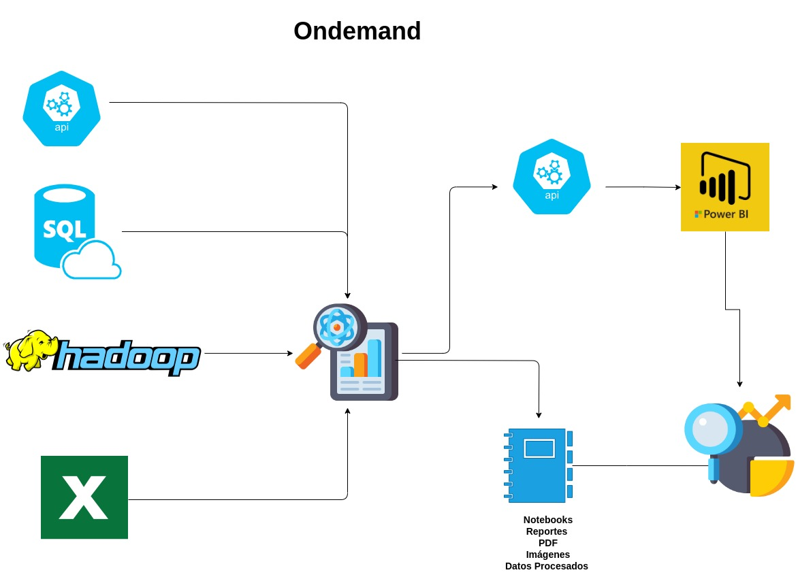
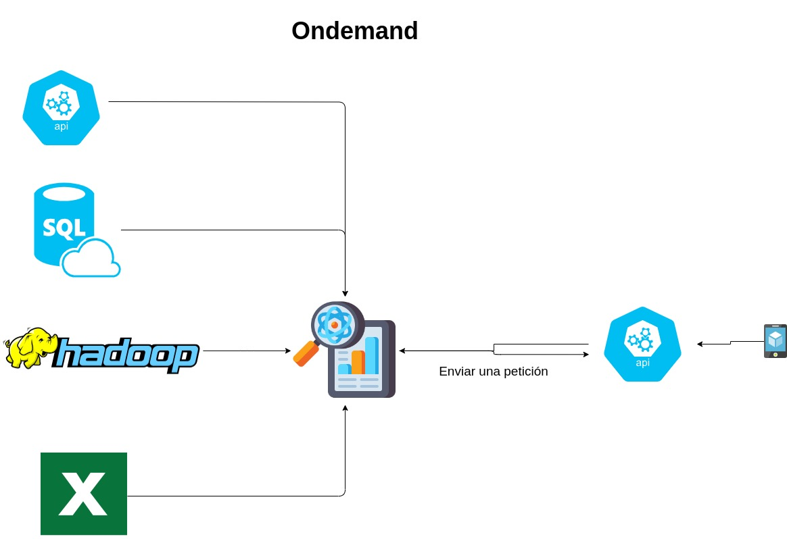

---

---
# Proyecto de Machine Learning: Predicción de Deserción de Empleados 🏃‍♂️🏢

En este tipo de proyectos, los datos históricos son la clave para entrenar nuestros modelos. Necesitamos entender y cuantificar los comportamientos pasados para hacer predicciones futuras. 

- **Entrada**: Datos de empleados (satisfacción laboral, último aumento de sueldo, tiempo en la empresa, etc.) 📊
- **Salida**: Predicciones de quiénes son más propensos a dejar la empresa. 👨‍💼🚀
- **Solución**: Un modelo de machine learning entrenado para predecir la deserción de empleados. 🧠💡

---

# Análisis de Negocios: Análisis de Ventas de un Negocio de Comercio Electrónico 💼📈

A diferencia de los proyectos de Machine Learning, aquí el foco está en analizar y entender los datos para obtener insights que puedan informar decisiones de negocios.

- **Entrada**: Datos de ventas (productos, cantidades, horarios, etc.) 🛒🕓
- **Salida**: Insights de negocios (productos más vendidos, horas pico, etc.) 🔎💼
- **Solución**: Un reporte de análisis de ventas con insights y recomendaciones. 📄🖋️

---

# Consideraciones Finales 🎯💭

- Ambos tipos de proyectos dependen en gran medida de los datos, pero su enfoque es diferente. 🔄
- El análisis de negocios se centra más en la comprensión de los datos, mientras que el machine learning se enfoca en la predicción. 👀🔮
- En ambos casos, la entrada y salida de información es clave para la solución final. 🔑💼
- La elección entre un enfoque y otro depende del contexto y los objetivos de la empresa. 🏢🎯

---

# ¿Cómo Elegir el Enfoque Adecuado? 🤔💡

Para elegir el enfoque adecuado para tu proyecto, debes considerar:

- ¿Cuál es tu objetivo principal? ¿Comprender los datos o hacer predicciones? 🎯🔮
- ¿Qué tipo de datos tienes disponibles? 📊💻
- ¿Cuáles son las necesidades y objetivos de tu empresa o cliente? 🏢💼

El enfoque que elijas debe estar alineado con estos factores. ✔️💡

---

# Conclusiones Finales 📚💡

- Tanto el machine learning como el análisis de negocios son herramientas valiosas en la ciencia de datos. 🧪🔬
- La elección entre uno y otro depende de las necesidades y objetivos específicos de tu proyecto. 🎯🏁
- En ambos casos, un enfoque estructurado y basado en datos es esencial para el éxito. 📈💡

---
# Proyecto del clase

---
# ¡Gracias! 🙏🏼👨